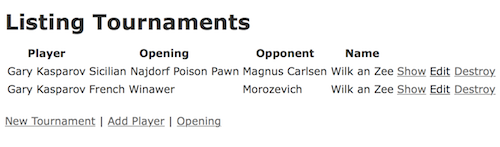

#Tournament

###An exercise in has_many through

A chess tournament crosstable is a quintessential example from which a has_many through relationship in Rails can be modelled.

A Tournament has many players.  There are many games played between players. In looking up a tournament one should be to find a report of the games played and by whom.

To set up the associations I modelled Tournament, Player, and Opening as a represenation of a full game.  

<strong>Tournament</strong>

*  belongs_to :opening
*  belongs_to :player
*  belongs_to :opponent, :class_name => 'Player'

<strong> Player </strong>

*  has_many :tournaments
*  has_many :openings :through => :tournaments
*  has_many :opponents, :trough => :tournaments

<strong>Opening</strong>

*  has_many :tournaments
*  has_many :players, :through => :tournaments

There are further associations that can be made such as not all games are played in tournaments.  Some might be matches, simuls, blindfold exhibitions.  Not all games are of the same length, some may be blitz, rapid, or stardard time controll.  These are currently outside the scope of this project.
